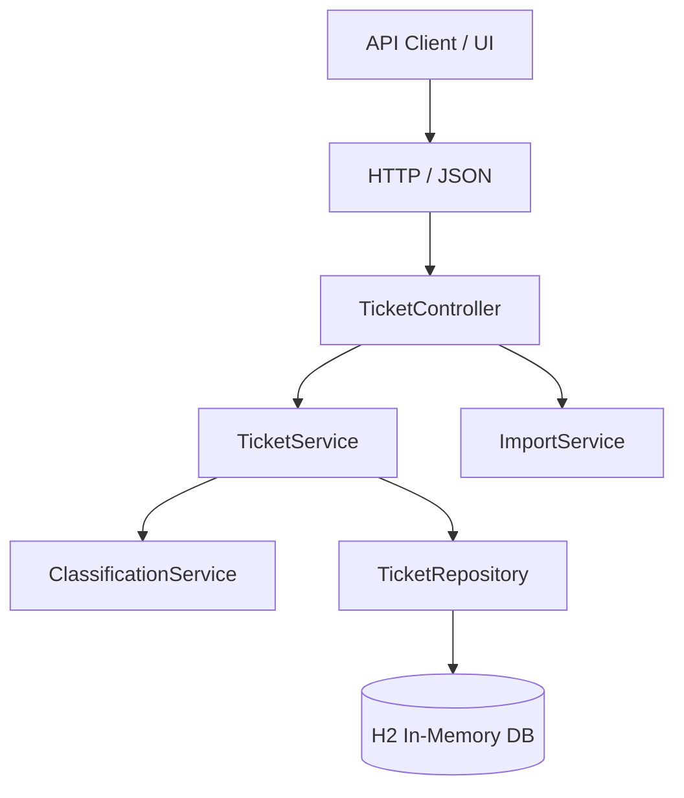
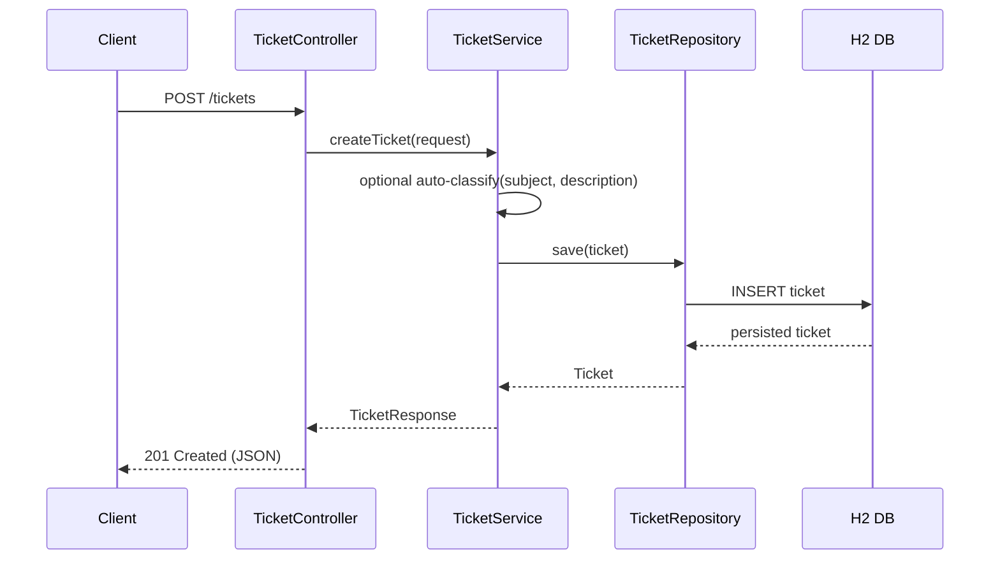

# Architecture – Support Tickets Service

## High-Level View

- **Controller Layer**: `TicketController` exposes REST endpoints under `/tickets`.
- **Service Layer**: `TicketService` holds business rules; `ImportService` handles CSV/JSON/XML parsing; `ClassificationService` applies keyword-based classification.
- **Persistence Layer**: `TicketRepository` is a Spring Data JPA repository for the `Ticket` entity.
- **Database**: In-memory H2 database, schema auto-managed via JPA.

## Testing & Automation Infrastructure

The project includes a robust set of scripts for validation and data management:

- **End-to-End Testing**: `scripts/test_e2e.sh` triggers the `TicketEndToEndTest` suite, verifying complete user workflows and concurrency.
- **Data Generation**: `scripts/generate_sample_data.py` creates randomized datasets in all supported formats (CSV, JSON, XML).
- **Data Loader**: `scripts/load_sample_data.sh` facilitates manual testing by bulk-uploading generated data to a running instance.

## Ticket Lifecycle

## Import Workflow

- `TicketController` receives `POST /tickets/import` with a multipart `file`.
- `ImportService.importFile` detects format by filename/content type and delegates to `importCsv`, `importJson`, or `importXml`.
- Each import method:
  - Parses file into `TicketCreateRequest` objects.
  - Validates with Jakarta Validator.
  - Persists valid tickets via `TicketService.createTicket`.
  - Collects per-record errors into `BulkImportResponse`.

## Design Decisions

- **Keyword-based classification**: deterministic, explainable rules (`ClassificationService`) instead of external ML dependency.
- **DTO separation**: `TicketCreateRequest`, `TicketUpdateRequest`, and `TicketResponse` decouple API contracts from the JPA entity.
- **Enum usage**: `TicketCategory`, `TicketPriority`, `TicketStatus`, `MetadataSource`, and `DeviceType` constrain allowed values.
- **Error handling**: `GlobalExceptionHandler` centralizes HTTP status codes and error payloads.

## Security & Performance Considerations

- H2 is in-memory and intended for development/test; for production, switch to a persistent database.
- Request payloads are validated to prevent malformed or excessively long input.
- CSV/JSON/XML parsing is streamed at request scope; file size is limited by Spring `multipart` settings.
- Logging avoids persisting sensitive data while still capturing classification decisions.
