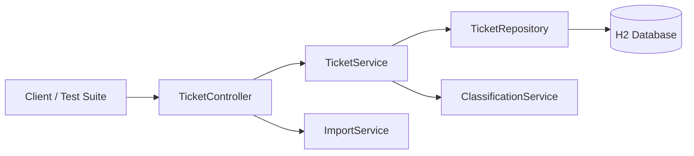

# Homework 2: Support Tickets Service (Java)

> **Student Name**: Ivan Petrych
> **Date Submitted**: 21.03.2026
> **AI Tools Used**: [Claude Sonnet 4.6, GPT-5.1, Gemini 3 Pro]

## Overview

Spring Boot 3 service for managing customer support tickets with multi-format import (CSV/JSON/XML) and rule-based auto-classification.

## Key Features

- RESTful CRUD API under `/tickets`
- Bulk import endpoint accepting CSV, JSON, and XML
- Server-side validation using Jakarta Bean Validation
- Keyword-based category and priority classification
- H2 in-memory database with Spring Data JPA
- Global error handling with consistent JSON error payloads

## High-Level Architecture



## Getting Started

### Prerequisites

- JDK 17+
- Maven 3.9+

### Run the Application

From `homework-2/support-tickets`:

```bash
mvn spring-boot:run
# or
./scripts/run.sh
```

The service listens on `http://localhost:8080`.

### Run Tests and Coverage

From `homework-2/support-tickets`:

```bash
mvn test
# or
./scripts/test.sh
```

JaCoCo HTML report is generated under `target/site/jacoco`.

### Run End-to-End Tests

To run the full integration suite verifying lifecycle, import, and concurrency:

```bash
./scripts/test_e2e.sh
```

### Sample Data Generation & Loading

Generate realistic test datasets (CSV, JSON, XML):

```bash
python3 scripts/generate_sample_data.py
# Creates files in src/test/resources/data/
```

Load generated data into a running application:

```bash
./scripts/load_sample_data.sh
```

## Project Structure

- `support-tickets/src/main/java/com/support/tickets/controller` – REST controller
- `support-tickets/src/main/java/com/support/tickets/service` – business logic, import, classification
- `support-tickets/src/main/java/com/support/tickets/model` – JPA entities and enums
- `support-tickets/src/main/java/com/support/tickets/dto` – request/response DTOs
- `support-tickets/src/main/java/com/support/tickets/repository` – Spring Data repositories
- `support-tickets/src/main/java/com/support/tickets/exception` – global error handling
- `support-tickets/src/main/resources` – app configuration (H2, logging)
- `support-tickets/src/test` – controller, service, import, and integration tests
