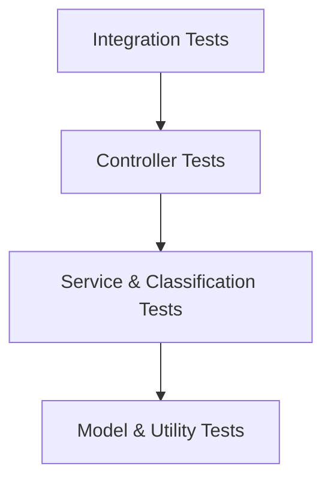

# Testing Guide – Support Tickets Service

## Test Strategy

The project uses JUnit 5 and Spring Boot Test with a focus on API, service, import, classification, and integration coverage.



## Test Types

- **Controller tests** (`WebMvcTest`): `TicketControllerTest` covers all REST endpoints, validation, and error handling.
- **Service tests**: `TicketServiceTest` validates business rules and update logic.
- **Import tests**: `ImportCsvTest`, `ImportJsonTest`, `ImportXmlTest`, and `ImportServiceFileTest` cover format detection, validation, and error reporting.
- **Classification tests**: `ClassificationServiceTest` covers keyword-based category and priority decisions.
- **Integration tests**: `TicketIntegrationTest` exercises end-to-end flows against H2.
- **End-to-End tests**: `TicketEndToEndTest` validates full lifecycle, bulk imports, and concurrent load.

## Running Tests

### Unit & Integration Tests

From `homework-2/support-tickets`:

```bash
mvn test
# or
./scripts/test.sh
```

### End-to-End (E2E) Tests

Run the specialized E2E suite:

```bash
./scripts/test_e2e.sh
```

JaCoCo enforces a minimum **85% instruction coverage** at the Maven module level.

HTML coverage report:

- Location: `support-tickets/target/site/jacoco/index.html`

## Sample Test Data

### Automatic Generation
Use the Python script to generate fresh random datasets (50 CSV, 20 JSON, 30 XML tickets):

```bash
python3 scripts/generate_sample_data.py
```

### Data Files Location
Generated files are stored under `src/test/resources/data/`:
- `sample_tickets.csv`
- `sample_tickets.json`
- `sample_tickets.xml`

### Static Fixtures
Static fixture files are stored under:

- `support-tickets/src/test/resources/fixtures`
  - `valid_tickets.csv`, `valid_tickets.json`, `valid_tickets.xml`
  - `invalid_tickets.csv`, `invalid_tickets.json`, `invalid_tickets.xml`

These are used by import tests to verify positive and negative scenarios.

## Manual Testing Checklist

- **Load Sample Data**: Run `./scripts/load_sample_data.sh` to populate the DB with realistic data.
- Create a ticket with valid data (`POST /tickets`).
- Verify validation errors for missing fields and invalid email.
- Import tickets using CSV, JSON, and XML via `POST /tickets/import`.
- Retrieve tickets with and without filters via `GET /tickets`.
- Update status/priority using `PUT /tickets/{id}`.
- Trigger classification using `POST /tickets/{id}/auto-classify` and verify category, priority, and confidence.
- Delete a ticket and confirm `GET /tickets/{id}` returns `404`.
